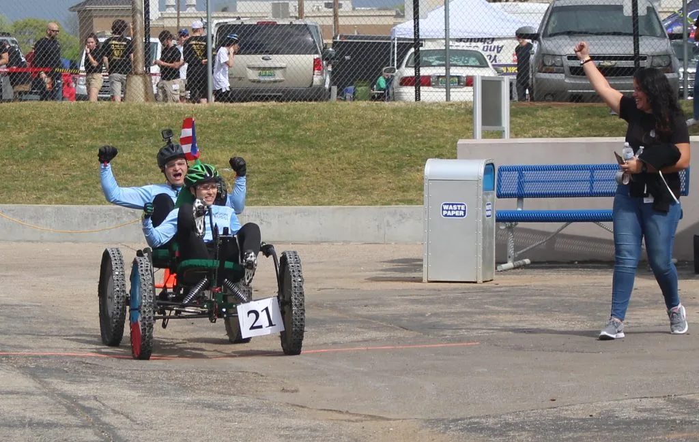
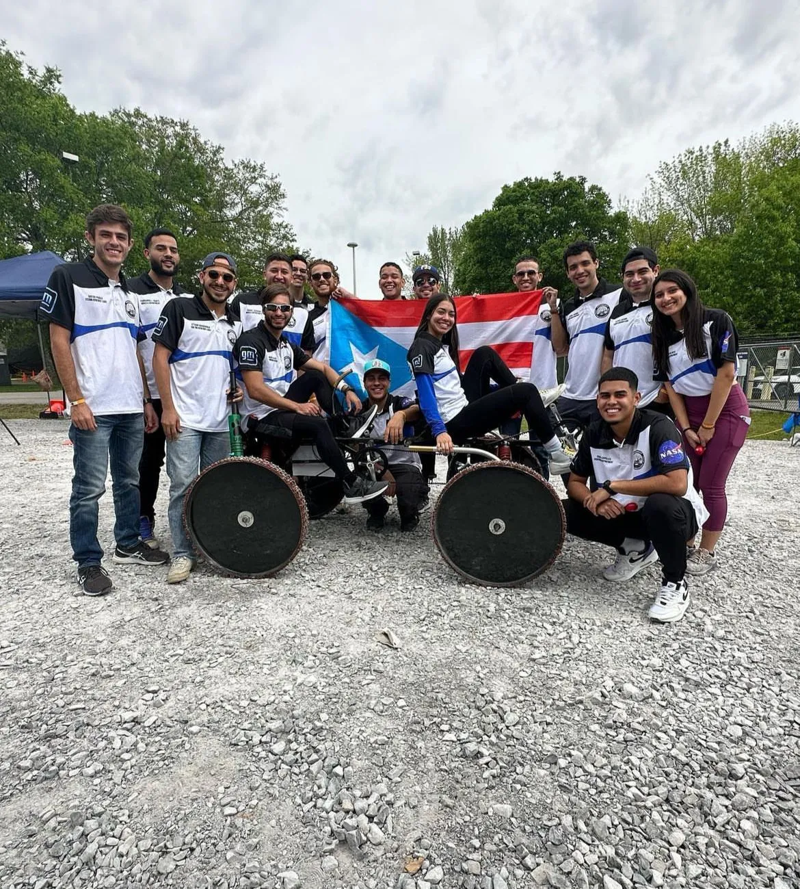

<!-- 
In this file, upload team photos by dragging and dropping them while
holding shift key. The photos will be automatically saved to the appropiate
teamPhotos folder.

src/images/content/teamPhotos
   -->

